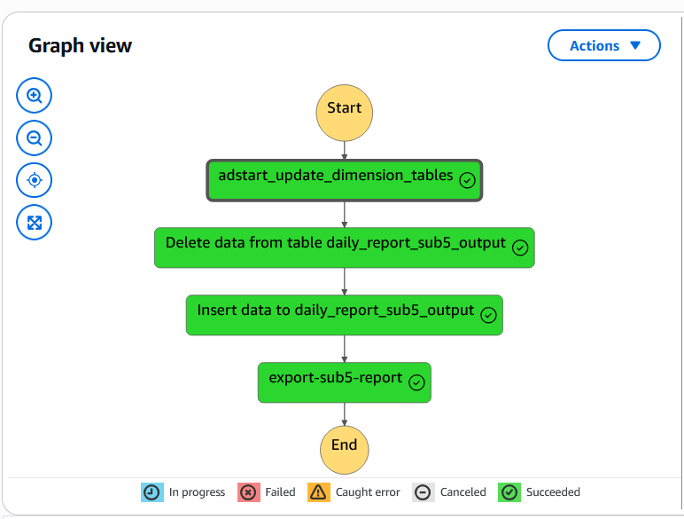

# Marketing Analytics Data Lakehouse

## Project Overview

This project implements a serverless data lakehouse architecture on AWS to deliver daily marketing analytics reports for the marketing agency. The solution leverages AWS's serverless components (S3, Lambda, Glue, Athena, Step Functions) to create a scalable, cost-efficient platform that processes marketing data from the Affise API.

### Key Features

- **Automated Data Pipeline**: Scheduled twice-daily data processing workflow
- **Serverless Architecture**: Zero infrastructure management with pay-per-use model
- **Optimized Query Performance**: Data stored in analytics-optimized formats
- **Incremental Processing**: 7-day rolling window to manage Athena query timeouts
- **Robust Error Handling**: Automatic retries and failure notifications

## Solution Architecture

The solution follows modern data lakehouse principles with distinct data layers:

- **Bronze Layer**: Raw JSON data from Affise API stored in S3
- **Silver Layer**: Processed/transformed data in Parquet format
- **Gold Layer**: Analytics-ready data in Athena tables

### Step Function Workflow

#### Workflow Steps

1. **Start**
2. **adstart_update_dimension_tables (Lambda Function)**

   - Fetches the latest offer data from the Affise API
   - Transforms and loads data to dimension tables in S3
   - Ensures up-to-date offer details before report generation

3. **Delete data from table daily_report_sub5_output (Athena SQL)**

   - Clears data from the past 7 days to prevent duplicates
   - Limits the query scope to avoid Athena timeouts

4. **Insert data to daily_report_sub5_output (Athena SQL)**

   - Transforms and combines offer data with click and conversion metrics
   - Inserts processed data for the past 7 days into reporting table
   - Joins multiple data sources including offers, affiliates, and advertisers

5. **export-sub5-report (Lambda Function)**

   - Queries the final dataset from Athena
   - Formats data as CSV with proper column ordering and escaping
   - Uploads report to S3 for Marketing team access

6. **End**

## Technical Implementation

### Data Collection

The solution uses Lambda functions to fetch marketing offer data and caps information from the Affise API:

- Pagination for handling large datasets
- Error handling with automatic retries
- Authentication via AWS Secrets Manager
- Data normalization for nested structures

### Data Processing

The data processing pipeline includes:

- Glue jobs for processing complex offer data structures
- ETL transformations to join and aggregate marketing metrics
- Athena SQL for analytics-ready data preparation
- Incremental processing to manage query timeouts

### Data Storage

Data is stored in a multi-layer approach:

- Raw data in JSON format
- Processed data in Parquet format for optimal query performance
- Final reporting tables accessible via Athena

## Operations

### Scheduling

The pipeline runs twice daily via EventBridge:

- **Morning Report**: 9:00 AM (Server Time)
- **Afternoon Update**: 2:00 PM (Server Time)

### Monitoring & Error Handling

- Step Functions execution tracking with visual workflow monitoring
- Automatic retries for transient API failures
- Detailed logging at each step

## Environment Configuration

### Lambda Functions

The project uses containerized Lambda functions with custom Docker images:

- `adstart_update_dimension_tables`: Fetches and processes offer data
- `export-sub5-report`: Exports finalized reports to S3

### AWS Glue ETL

Glue jobs like `adstart_sub5_get_offer_caps_data` process complex offer data structures:

- Extract caps data and affiliate relationships
- Format data for optimal query performance

### Athena Queries

Complex SQL transformations for reporting:

- Join dimensional data with fact tables
- Calculate performance metrics
- Filter and format for business requirements

## Development and Deployment

### Prerequisites

- AWS CLI configured with appropriate permissions
- Docker for Lambda function container builds
- Access to Affise API credentials

### Deployment Steps

1. Create AWS resources (S3 buckets, IAM roles, etc.)
2. Deploy Lambda functions as containers
3. Create Glue jobs for ETL processing
4. Configure Step Functions workflow
5. Set up EventBridge triggers for scheduling

## Future Enhancements

1. **Data Quality Monitoring**: Add automated data quality checks
2. **Dashboard Integration**: Connect with QuickSight for interactive visualizations
3. **Real-time Processing**: Add streaming capabilities for near real-time insights
4. **Enhanced Alerting**: Implement SNS notifications for critical failures

## Schedule & Execution

⏰ **Frequency**: Twice daily
⏱️ **Execution Times**: 9:00 AM and 2:00 PM (Server Time)
🔄 **Configuration**: EventBridge rules trigger Step Functions workflow

