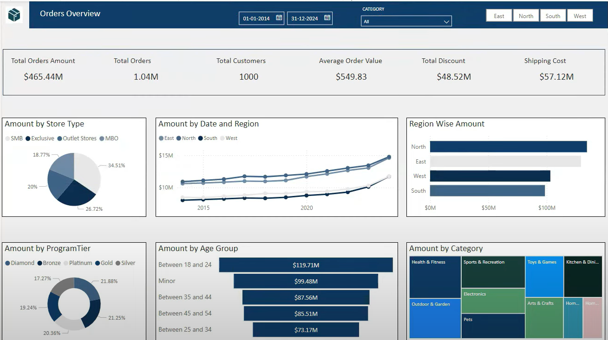

# End-to-End Data Warehouse & Business Intelligence Project


## Project Overview

This project demonstrates a comprehensive end-to-end Data Warehouse and Business Intelligence (DWBI) solution, showcasing the entire data lifecycle from generation and extraction to transformation, storage, and visualization. Using a retail sales scenario, the project implements best practices in data modeling, ETL processes, and dashboard creation.

### Key Features

- **Test Data Generation**: Python scripts to create realistic sample data
- **Data Extraction**: Methods to extract data from Oracle databases
- **Data Modeling**: Implementation of star and snowflake schemas
- **Data Warehouse**: Snowflake setup and configuration
- **BI Dashboards**: Interactive Power BI visualizations
- **Ad-Hoc Analysis**: SQL queries for advanced analytics

## Dashboard Highlights



The main Power BI dashboard delivers a comprehensive "Orders Overview" that provides stakeholders with essential insights:

### Key Metrics

- **Total Orders Amount**: $465.44M in total revenue
- **Order Volume**: 1.04M total orders processed
- **Customer Base**: 1,000 unique customers
- **Average Order Value**: $549.83 per order
- **Total Discount**: $48.52M in discounts applied
- **Shipping Cost**: $57.12M in shipping expenses

### Visual Analytics

1. **Store Performance by Type**:

   - Pie chart breakdown showing distribution across store types
   - SMB (34.51%), Exclusive (26.72%), MBO (20.00%), and Outlet stores (18.77%)

2. **Regional Performance Trends**:

   - Line chart showing amount by date and region
   - Tracks performance of East, North, South, and West regions over time (2015-2020)
   - Shows year-over-year growth with notable uptick in recent periods

3. **Region-wise Revenue**:

   - Horizontal bar chart comparing revenue across regions
   - North and East regions showing strongest performance

4. **Loyalty Program Analysis**:

   - Donut chart showing distribution across program tiers
   - Diamond, Platinum, Gold, Silver and Bronze segments

5. **Age Group Analysis**:

   - Bar chart showing sales by customer age demographics
   - Highest revenue from the 18-24 age group ($119.71M)
   - Strong performance from Minor age group ($99.48M)
   - 35-44 ($87.56M), 45-54 ($85.51M), and 25-34 ($73.17M) age brackets

6. **Category Performance**:
   - Treemap visualization showing sales by product category
   - Categories include Health & Fitness, Sports & Recreation, Toys & Games, etc.

The dashboard features interactive filtering capabilities with:

- Date range selector (currently showing data from 01-01-2014 to 31-12-2024)
- Category dropdown filter
- Region toggle buttons (East, North, South, West)

## Architecture

The project follows a simplified data warehouse architecture:

1. **Source Systems**: Oracle database and generated test data
2. **Extraction Layer**: Python scripts for data extraction
3. **Staging Area**: Temporary storage for raw data
4. **Transformation Layer**: SQL transformations in Snowflake
5. **Data Warehouse**: Star/snowflake schema in Snowflake
6. **Reporting Layer**: Power BI dashboards and reports

## Data Modeling

### Entity-Relationship Model

The project implements a retail sales data model with the following entities:

- Stores
- Products
- Customers
- Orders
- Date (time dimension)
- Loyalty programs

### Schema Design

The project demonstrates both star and snowflake schemas:

- **Star Schema**: Fact table (Orders) directly connected to dimension tables
- **Snowflake Schema**: Normalized dimensions (like Products) with hierarchical relationships

## Implementation Details

### 1. Data Generation

Python scripts generate realistic test data for all dimensions:

- Customer data with demographics
- Product information with categories and pricing
- Store locations with opening dates
- Order transactions with amounts and dates

Key libraries used:

- Pandas for data manipulation
- Faker for generating realistic names and addresses
- NumPy for random number generation

Example of generated data structure:

```
customer_id,first_name,last_name,email,gender,date_of_birth,address,city,country,loyalty_id
1,John,Smith,john.smith@example.com,Male,1985-04-12,123 Main St,New York,USA,2
...
```

### 2. Database Setup in Snowflake

The project includes:

- Creating a dedicated database
- Setting up schemas for staging, warehouse, and reporting
- Configuring user access and permissions
- Creating file formats for data loading

### 3. Data Loading Process

Steps to load data into Snowflake:

- Creating file formats and stages
- Using PUT command to upload CSV files
- Using COPY command to load data into tables
- Data validation and error handling

### 4. Data Transformation

SQL transformations performed in Snowflake:

- Date corrections for order dates
- Joining fact and dimension tables
- Calculating derived metrics
- Creating views for reporting

### 5. Power BI Implementation

The Power BI dashboards include:

- Data model with proper relationships
- Calculated columns for age groups
- Measures for sales metrics
- Interactive visualizations (charts, maps, tables)
- Filters and slicers for interactivity

## Key SQL Queries

The project demonstrates several advanced SQL concepts:

### Customer Analysis

```sql
WITH CustomerOrders AS (
  SELECT
    c.customer_id, c.first_name, c.last_name,
    COUNT(o.order_id) as order_count,
    SUM(o.order_amount) as total_spent,
    ROW_NUMBER() OVER (ORDER BY SUM(o.order_amount) DESC) as rank
  FROM dim_customer c
  JOIN fact_orders o ON c.customer_id = o.customer_id
  GROUP BY c.customer_id, c.first_name, c.last_name
)
SELECT * FROM CustomerOrders WHERE rank <= 10;
```

### Product Performance

```sql
SELECT
  p.product_name, p.category,
  SUM(o.order_amount) as sales_amount,
  COUNT(o.order_id) as order_count
FROM dim_product p
JOIN fact_orders o ON p.product_id = o.product_id
JOIN dim_date d ON o.order_date_id = d.date_id
WHERE d.year = 2023
GROUP BY p.product_name, p.category
ORDER BY sales_amount DESC;
```

## Project Structure

```
end-to-end-dashboard-analytics/
├── DB Code/
│   └── DDL.sql                # Database definition scripts
├── Excel/
│   └── ER Diagram.xlsx        # Entity relationship diagram
├── Landing Directory/
│   └── Store_*_yyyymmdd.csv   # Generated store data files
├── Lookup Data/
│   └── [various lookup files]
├── One Time Load/
│   └── [initial load files]
├── Python Files/
│   ├── generate_customers.py
│   ├── generate_products.py
│   ├── generate_stores.py
│   └── generate_transactions.py
└── README.md
```

## How to Use This Project

1. **Setup Environment**:

   - Install Python 3.6+ with required libraries (pandas, numpy, faker)
   - Sign up for Snowflake trial account
   - Install Power BI Desktop

2. **Generate Test Data**:

   - Run Python scripts in the "Python Files" directory
   - Verify generated data in "Landing Directory"

3. **Setup Snowflake**:

   - Execute DDL scripts to create database objects
   - Configure file formats and stages

4. **Load Data**:

   - Use Snowflake's PUT and COPY commands to load data
   - Run data transformation SQL scripts

5. **Create Power BI Reports**:
   - Connect Power BI to Snowflake
   - Create data model with proper relationships
   - Design interactive dashboards

## Key Learnings

- **Data Modeling**: Understanding the differences between star and snowflake schemas and their appropriate use cases
- **ETL Processes**: Building efficient data extraction, transformation, and loading pipelines
- **SQL Optimization**: Writing effective SQL for data analysis and transformation
- **Dashboard Design**: Creating informative and interactive business intelligence dashboards
- **Data Quality**: Implementing validation and error handling in the data pipeline

## Dashboard Development Process

The Power BI dashboard was developed through several key steps:

1. **Data Connection**: Connecting Power BI to Snowflake using the native connector
2. **Data Model Creation**:

   - Setting up table relationships between fact and dimension tables
   - Creating a proper star schema in the Power BI model
   - Implementing appropriate data types and formats

3. **Measure Creation**:

   - Developing DAX measures for key metrics including:

   ```
   Total Orders = COUNT(fact_orders[order_id])
   Total Revenue = SUM(fact_orders[order_amount])
   Average Order Value = DIVIDE([Total Revenue], [Total Orders])
   ```

4. **Calculated Columns**:

   - Age calculation based on birth date
   - Age group categorization
   - Geographic hierarchy for drill-down analysis

5. **Visualization Design**:

   - Layout planning with key metrics at top for visibility
   - Strategic use of charts based on data requirements
   - Consistent color scheme for regional/categorical analysis

6. **Parameter Implementation**:

   - Date parameters for flexible time range analysis
   - User-friendly filter controls in the top section

7. **Performance Optimization**:
   - Strategic use of indices in Snowflake
   - Query folding to push processing to the database
   - Import mode for faster dashboard interactions

## Future Enhancements

- Implement incremental data loading
- Add automated data quality checks
- Create a real-time reporting solution
- Implement machine learning models for sales prediction
- Add data governance and documentation
- Expand dashboard with forecasting capabilities
- Add mobile-optimized view for on-the-go analytics

## Tools Used

- **Python**: For test data generation and ETL processes
- **Snowflake**: Cloud data warehouse
- **Oracle**: Source database system
- **Power BI**: Business intelligence and visualization
- **SQL**: Data transformation and analysis
- **Pandas**: Data manipulation library
- **Excel**: For ER diagram creation

---

## FAQ

### What tools are used in the DWBI project?

The project uses Python for data generation and extraction, Snowflake as the cloud data warehouse, Oracle as a source database, and Power BI for visualization and reporting.

### How is data loaded into Snowflake?

Data is loaded using Snowflake's PUT command to upload files to stages and then the COPY command to load data into tables. The process includes creating file formats, stages, and validating loaded data.

### What is the significance of star and snowflake schemas?

Star schemas have a central fact table directly connected to dimension tables, optimizing query performance for analytics. Snowflake schemas normalize dimension tables, saving storage space but potentially adding complexity to queries.

---
