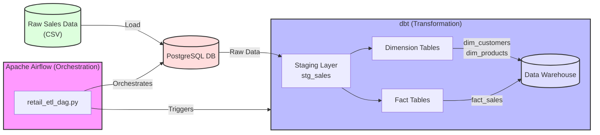

```mermaid
graph LR
    %% Data Sources
    CSV[("Raw Sales Data\n(CSV)")] -->|Load| PS[(PostgreSQL DB)]
    
    subgraph Airflow["Apache Airflow (Orchestration)"]
        DAG["retail_etl_dag.py"]
    end
    
    subgraph DBT["dbt (Transformation)"]
        direction TB
        STG["Staging Layer\nstg_sales"] --> DIM["Dimension Tables"]
        STG --> FACT["Fact Tables"]
        DIM -->|"dim_customers\ndim_products"| DW
        FACT -->|"fact_sales"| DW[(Data Warehouse)]
    end
    
    PS -->|Raw Data| STG
    DAG -->|Orchestrates| PS
    DAG -->|Triggers| DBT
    
    style Airflow fill:#f9f,stroke:#333,stroke-width:2px
    style DBT fill:#bbf,stroke:#333,stroke-width:2px
    style CSV fill:#dfd,stroke:#333,stroke-width:2px
    style PS fill:#fdd,stroke:#333,stroke-width:2px
    style DW fill:#ddf,stroke:#333,stroke-width:2px
```